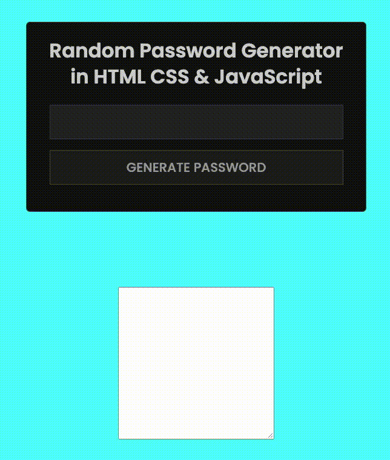

## Random Password Generator

- Using HTML CSS & Javascript

- JS using document.execCommand("copy") to copy password to clipboard

- JS using Math.floor() & Math.random() to randomly generate a 16 digitpassword.

